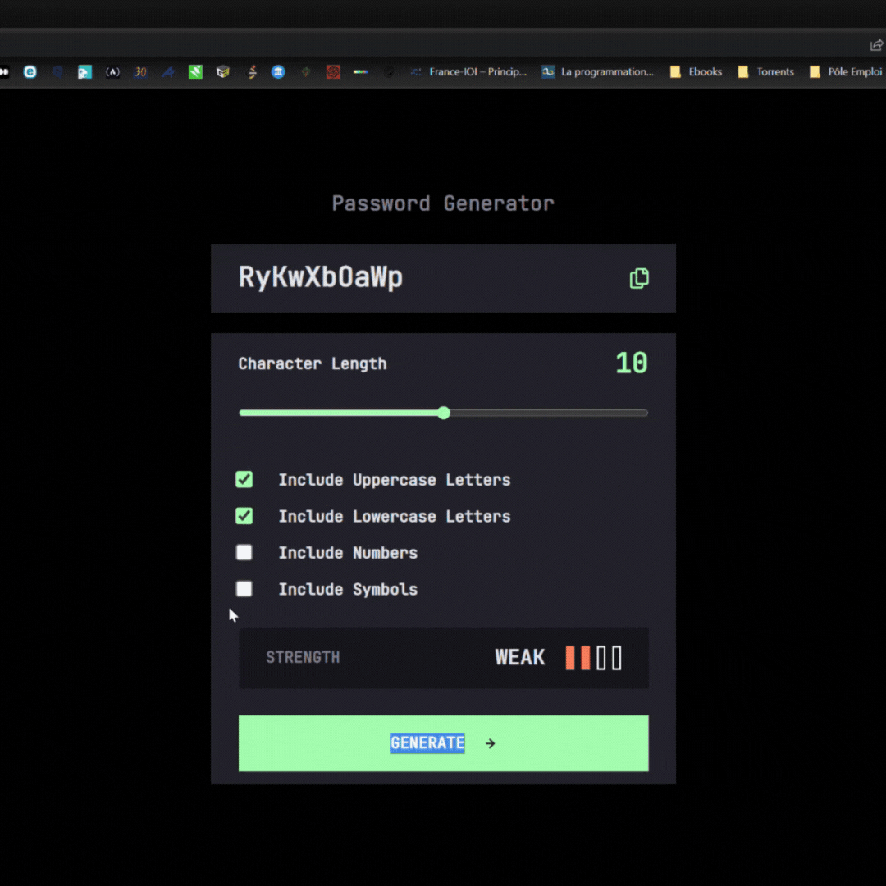

# Generateur de mot de passe

J'ai voulu comprendre comment fonctionner un generateur de mot de passe:

Pour réaliser ce challenge, j'ai codé en premier lieu la logique d'un générateur de mot de passe random. 
A partir de trois variables qui contiennent l'alphabet, des chiffres et des caractères spéciaux. 
Ensuite j'ai utilisé les méthodes Math.floor et Math.random afin de générer un nombre aléatoire qui va 'piocher' dans les variables. 

Le résultat est visible à l'adresse suivante : 

https://scintillating-jelly-f6b135.netlify.app/
